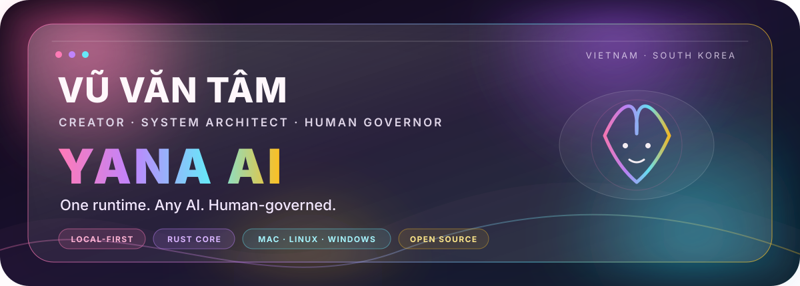
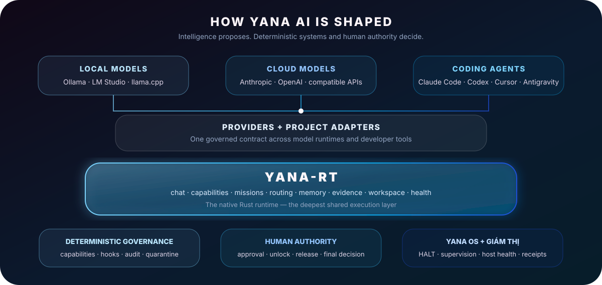

<p align="center">
  
</p>

<p align="center">
  <a href="https://github.com/yanacuti1121/Yana-AI"><strong>Yana AI</strong></a> ·
  <a href="https://yanacuti1121.github.io/Yana-AI/">Documentation</a> ·
  <a href="https://yanacuti1121.github.io/Yana-AI/desktop.html">Desktop App</a> ·
  <a href="https://crates.io/crates/yana-rt">Rust Runtime</a> ·
  <a href="https://pypi.org/project/yana-ai/">Python CLI</a>
</p>

<p align="center">
  <a href="https://github.com/yanacuti1121/Yana-AI/actions/workflows/ci.yml"></a>
  <a href="https://crates.io/crates/yana-rt"></a>
  <a href="https://pypi.org/project/yana-ai/"></a>
  <a href="https://github.com/yanacuti1121/Yana-AI/blob/main/LICENSE"></a>
</p>

---

## The human behind Yana AI

I’m **Vũ Văn Tâm**, a Vietnamese developer based in South Korea. I began building the system that became Yana AI when I was 17.

Yana did not begin as a startup pitch or a polished application. It began as files on my own computer: Claude Code configurations, safety rules, prompts, hooks, and automation experiments that I used to make AI-assisted development more reliable. That early system was called **YAMTAM ENGINE**.

As I used it, the problem became larger than configuration. Different models and coding agents could write code, but they did not share one runtime, one capability boundary, one memory model, or one definition of when a human must take control. The files became a scaffold; the scaffold became a runtime; the runtime became Yana AI.

| At a glance | |
|---|---|
| **Background** | Vietnamese builder living in South Korea |
| **Project** | Creator and primary maintainer of [Yana AI](https://github.com/yanacuti1121/Yana-AI) |
| **Role** | Product direction, system architecture, implementation, operations, release decisions, and final human governance |
| **Core focus** | Native runtimes, local AI, agent safety, automation, memory, orchestration, and cross-platform systems |
| **Working model** | Human-directed, AI-assisted, evidence-driven engineering |

I work with Claude, Codex, Gemini, local models, and specialist agents as engineering collaborators. They help implement, review, test, and challenge decisions. I do not hide that collaboration, and I do not transfer responsibility to it: authorship is credited where possible, while architecture, risk acceptance, release authority, and the project’s direction remain human decisions.

> **My job is to make AI more capable without quietly making the human less in control.**

---

## From YAMTAM to Yana AI

The project has two histories: the code existed locally before this GitHub repository, and the public Git history begins later. I keep that distinction visible instead of turning uncertain dates into marketing facts.

| Date | Milestone | Evidence |
|---|---|---|
| **05 May 2026** | The name **YAMTAM ENGINE** reportedly appeared on an earlier local ZIP artifact. | Recorded as my account of the project’s genesis; the original artifact has not yet been independently re-verified. See the [lineage record](https://github.com/yanacuti1121/Yana-AI/blob/main/docs/history/LINEAGE.md). |
| **16 May 2026** | The earliest independently verified embedded Git commit, `scaffold baseline`, appears inside a preserved YAMTAM scaffold ZIP. | Verified from the archive’s embedded `.git` history and checksum, documented in the [lineage record](https://github.com/yanacuti1121/Yana-AI/blob/main/docs/history/LINEAGE.md). |
| **17 May 2026** | The surviving public repository history begins. YAMTAM runtime assets, Truth Gate, drift checking, memory, scope protection, Action Gate, and release tooling start entering the repository. | Verified directly from the [public repository history](https://github.com/yanacuti1121/Yana-AI/commits/main/). |
| **Today** | Yana is a local-first Rust runtime, project governance layer, terminal workspace, desktop app, adapter system, memory and evidence stack, Yana OS foundation, and open-source engineering project. | Implementations, tests, releases, architecture reports, and known limitations remain public in the main repository. |

The reported lineage is:

```text
Claude Code configurations → GitNexus experiments → YAMTAM ENGINE → Yana AI
```

This history matters because Yana was not invented all at once. It grew from repeated failures, real CI breakage, unsafe automation, duplicated runtimes, stale documentation, packaging mistakes, and the need to distinguish “a file exists” from “a capability is genuinely wired and usable.”

---

## What I am building

<h3 align="center">Yana AI 🐰</h3>
<p align="center"><strong>One runtime. Any AI. Human-governed.</strong></p>
<p align="center"><em>Build with AI. Govern what it builds.</em></p>

<p align="center">
  
</p>

Yana AI is a **local-first, cross-platform control and runtime system for AI**. It connects local models, cloud models, coding agents, project tools, memory, and automation to one native execution layer while keeping deterministic policy and human authority in the path.

It is not a foundation model and it is not tied to one provider. Yana does not try to replace Claude, Codex, Cursor, Ollama, LM Studio, or llama.cpp. It gives them a shared runtime and a governed boundary for what they may inspect, change, and execute.

<p align="center">
  
</p>

### The problem

AI can now read repositories, edit files, run commands, launch agents, call tools, and prepare releases. Intelligence is improving quickly, but operational control is still fragmented:

- each model or coding agent invents a different workflow;
- tool permissions are often mixed directly into UI or provider code;
- “safe”, “done”, and “approved” are frequently claims without evidence;
- local models and cloud models do not naturally share one governed execution layer;
- automation can become more autonomous without a clear boundary for when a human must decide.

Yana turns those questions into runtime behavior rather than policy text alone.

### The system

| Layer | What it does |
|---|---|
| **`yana-rt`** | The native Rust core for chat, capabilities, routing, missions, memory, evidence, workspace operations, host health, and runtime coordination. |
| **Model providers** | Connect local and cloud inference without spreading provider-specific logic throughout the interface. |
| **Project adapters** | Bring the same governed project contract to Claude Code, Codex, Cursor, and Antigravity. |
| **Capability runtime** | Centralizes repository, Git, host, process, and command operations so every interface uses the same boundary. |
| **Deterministic gates** | Check risky operations, scope, truth claims, destructive commands, integrity, and release evidence without asking another LLM to decide. |
| **Memory and evidence** | Preserve project facts, session context, turn history, receipts, and audit trails while keeping local-first defaults. |
| **Yana OS + Giám Thị** | Supervise the runtime and host, expose health, support HALT/quarantine flows, and keep high-autonomy behavior subordinate to human unlock. |
| **Terminal + Desktop** | Give the same core a keyboard-first local AI workspace and a graphical application rather than building separate brains for each UI. |

### What exists today

- A Rust runtime with native chat, streaming, cancellation, sessions, routing, missions, capabilities, health, workspace, and OS surfaces.
- Local model paths for Ollama, LM Studio, llama.cpp, and compatible local endpoints, alongside cloud-provider integrations.
- Project adapters for Claude Code, Codex, Cursor, and Antigravity.
- **2,025 skills**, **103 specialist agents**, **170 commands**, and **63 deterministic hooks** maintained from canonical sources.
- A multi-platform Electron desktop application and a Rust terminal chat experience connected to the same runtime direction.
- Project memory, evidence, audit, integrity, quarantine, and human approval mechanisms.
- Cross-platform work targeting macOS, Linux, and Windows.

These numbers describe a fast-moving project, not a promise that every surface has equal maturity. I keep architecture-health reports and known limitations public because runtime truth matters more than a large feature count.

---

## What makes Yana different

<table>
<tr>
<td width="25%" valign="top">

### ◆ Local-first

Local inference, project state, memory, and deterministic checks should work without mandatory telemetry or a cloud control plane.

</td>
<td width="25%" valign="top">

### ◇ Provider-neutral

The UI talks to runtime abstractions, not provider-specific code scattered across the product.

</td>
<td width="25%" valign="top">

### ◈ Deterministic

Safety-critical decisions use inspectable code, explicit gates, evidence, and reproducible tests—not another model’s confidence.

</td>
<td width="25%" valign="top">

### ◎ Human-governed

Higher autonomy requires stronger evidence and clearer human authority, not fewer controls.

</td>
</tr>
</table>

Yana’s autonomy model is intentionally asymmetric: routine work should become automatic, while irreversible or high-impact actions stay human-controlled.

```text
Observe → Recommend → Prepare → Execute safely → Escalate high-impact decisions
                                                  ↑
                                         human authority remains
```

---

## My responsibility inside the project

### I define the direction

I decide the product principles, the autonomy boundary, which runtimes and interfaces belong in Yana, and where the project should remain deliberately conservative.

### I protect the architecture

`yana-rt` is the deepest core. Terminal chat, desktop UI, project adapters, MCP surfaces, and future interfaces should converge on its capabilities rather than create independent execution paths. When duplicate implementations appear, I treat that as architectural debt.

### I operate the system

I investigate CI failures, release breakage, packaging gaps, hook races, platform differences, runtime regressions, and drift between documentation and executable behavior. A feature is not complete because its file exists; it must be reachable, wired, tested, packaged, and observable.

### I make the final call

Agents can propose architecture, write patches, review code, and run verification. I decide whether high-impact changes ship. Yana’s own development process follows the same philosophy the product enforces: **AI can act, but human authority defines how far it may go.**

---

## Current engineering focus

- Making the capability runtime the single source of truth across chat, MCP, project tools, and host operations.
- Deepening `yana-rt` integration so terminal and desktop interfaces share one runtime rather than duplicate behavior.
- Improving local AI sessions, memory recall, context management, model switching, and provider health.
- Building reliable cross-platform supervision for CPU, GPU, process, service, and Yana system health.
- Making releases reproducible without depending exclusively on GitHub-hosted automation.
- Raising autonomy for routine work while preserving explicit human gates for destructive, security-sensitive, and production actions.
- Continuously separating what is truly wired from what is only implemented, documented, experimental, or planned.

---

## Main project surfaces

| Surface | Purpose | Link |
|---|---|---|
| **Yana AI** | Main runtime, governance system, adapters, hooks, agents, skills, and documentation | [Repository](https://github.com/yanacuti1121/Yana-AI) |
| **Yana Desktop** | Cross-platform graphical AI workspace connected to the Yana runtime | [Download](https://yanacuti1121.github.io/Yana-AI/desktop.html) |
| **Yana Local Chat** | Rust terminal-native workspace for local and connected AI models | [Source](https://github.com/yanacuti1121/Yana-AI/tree/main/src/chat) |
| **`yana-rt`** | Native Rust runtime and CLI | [crates.io](https://crates.io/crates/yana-rt) |
| **`yana-ai`** | Python installer and project adapter CLI | [PyPI](https://pypi.org/project/yana-ai/) |
| **Documentation** | Architecture, installation, operations, limitations, and contribution guides | [Open docs](https://yanacuti1121.github.io/Yana-AI/) |
| **Yana GitHub App** | Repository-facing GitHub integration | [Install](https://github.com/apps/yana-ai-bot) |
| **CodexMate** | Companion dashboard for AI coding tools | [Project](https://sakurabytecore.github.io/codexmate/) |

---

## How I build

```text
Build > Talk
Ship > Promise
Verify > Assume
Evidence > Confidence
Human authority > silent autonomy
```

I use AI heavily, but I do not treat AI output as truth. My workflow emphasizes:

- inspect the real code before making architectural claims;
- test the execution path, not only isolated helpers;
- record authorship and review evidence;
- publish known limitations instead of hiding unfinished wiring;
- prefer small reversible changes over impressive but fragile rewrites;
- keep destructive and production actions explicitly human-gated.

---

## Technology

<p>
  
  
  
  
  
  
</p>

My strongest interest is not a single language. It is the boundary between **AI intelligence, native systems, developer tools, automation, and human control**.

---

## Open source and collaboration

Yana AI learns from open-source projects, research, runtime patterns, and real operational failures. When an upstream project directly influences an implementation, I aim to preserve license information and attribution in the relevant source or documentation.

Contributions are welcome—especially from people interested in Rust runtimes, local AI, terminal interfaces, cross-platform systems, safety engineering, reproducible releases, and human-centered automation.

<p align="center">
  <a href="https://github.com/yanacuti1121/Yana-AI/issues"></a>
  <a href="https://github.com/yanacuti1121/Yana-AI/blob/main/CONTRIBUTING.md"></a>
  <a href="https://github.com/sponsors/yanacuti1121"></a>
</p>

---

## Contact

| | |
|---|---|
| GitHub | [@yanacuti1121](https://github.com/yanacuti1121) |
| Email | [phamlongh230@gmail.com](mailto:phamlongh230@gmail.com) |
| Website | [Yana AI Documentation](https://yanacuti1121.github.io/Yana-AI/) |
| TikTok | [@yana018](https://www.tiktok.com/@.yana018) |

<p align="center">
  <strong>Your AI can act. But who decides how far it can go?</strong><br />
  <sub>I am building Yana AI so that answer remains visible, inspectable, and human.</sub>
</p>
